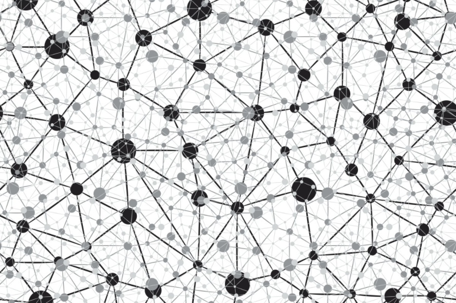
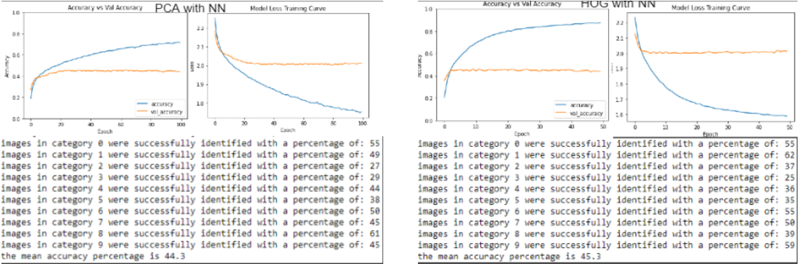
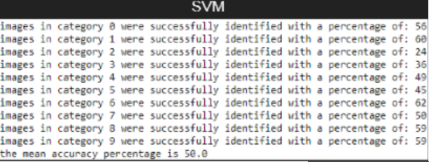
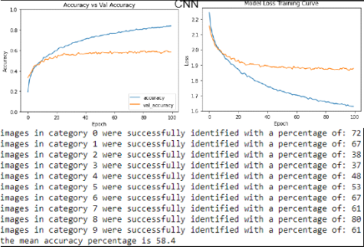
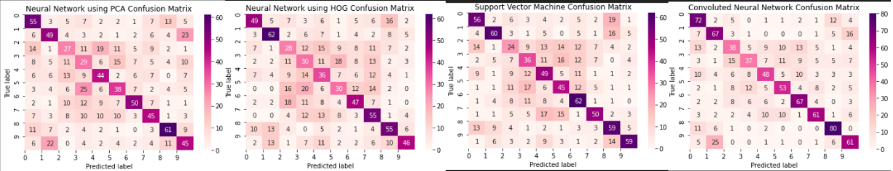

# What is the best approach for image classification with a small dataset?
### 10/12/2020
### Joshua Green 956213

## **CSC-345 Big Data And Machine Learning Coursework**

# Introduction

Using the CIFAR-10 dataset, it is possible to extract the features contained within the RGB elements to train a Neural Network for categorisation. For this task, a small section of the dataset will be used, and therefore choosing the best machine learning algorithm possible becomes more important; being that a larger dataset would bring with it a slightly different approach and higher accuracy as was discussed in the international journal for science and research [(‘Scaling up Machine Learning Algorithms for Large Datasets’, 2016)](https://paperpile.com/c/tlKYPw/ZchP).

To classify the images, I selected three methods: a fully connected neural network, a support vector machine model, and a convoluted neural network with layers responsible for feature extraction. I also compared dimensionality reduction with Principle Component Analysis (PCA) and feature extraction using the Histogram Of Gradient (HOG) algorithm. Of these, I expect CNN to perform the best, but the question still remains whether this will hold true with a small dataset size. Some of the issues surrounding such a question are explored in a paper presented at the ICSAI [(Dalal and Triggs, no date; Luo et al., 2018)](https://paperpile.com/c/tlKYPw/ndKo+6aU5).

# Method

Before starting, I transformed the image data so that calling images[i] would return the ith image.

## Neural Network

For my neural network I decided to have each layer reduce the number of neurons by a factor of 2. The neural network uses a single input layer of 128 and a hidden layer of 64 neurons. I then use a dropout layer making use of an aggressive 0.5 value to attempt to deal with overfitting, before using a softmax layer for output.

The batch size will be 128 as this seems like a reasonable figure for the size of the dataset.

### PCA

Using a fully connected neural network with the raw data would quickly result in overfitting, therefore a feature extractor must be used. I opted for PCA to reduce the dimensionality of the data for better processing by the model. This means the data had to be reduced to 2D before having the major patterns extracted by PCA through analysis of the variance between pixel colours. I used 0.9 for the n_components to reduce the number of components kept in the dataset. This simplified data can then be run through the neural network model to train for image classifications.

### HOG

Using HOG also extracts the major patterns in the data by analysing the change in the gradient between pixels. The simplified data generated will also be suitable for the neural network. I am using HOG here simply as a reference to see how my PCA implementation is performing in comparison. HOG has been discussed in depth in a paper regarding its use with an SVM algorithm, which is chiefly what I plan to use HOG with [(Dalal and Triggs, no date)](https://paperpile.com/c/tlKYPw/ndKo). Importantly, HOG is considered to be of similar performance to PCA, so I want to see how this stacks up with a small dataset of images.

## SVM

I also used an SVM since I know it is a viable approach having read the paper by Dalal and Triggs [(Dalal and Triggs, no date)](https://paperpile.com/c/tlKYPw/ndKo). Using SVM, we can analyse the clusters of similarity between images. I do this with use of images already transformed with HOG in order to reduce the complexity of the images to just the majour patterns. The algorithm will use the SVC classifier for the images so as not to make any assumption about the clusters to be analysed. It works best on low-dimensional data, which fits well with the HOG transformation I perform beforehand.

## CNN

The CNN has been designed to include convoluted layers responsible for feature extraction themselves, eliminating the need for anything like PCA or HOG. The CNN consists of convolution layers which are then pooled and fed into dense fully connected layers below. I use dropout layers to control the overfitting, and flatten the data between the convolutional layers and the dense layers. The output layer uses softmax for the 10 categorisations, while I use the rectified linear unit (ReLU) for the other layers.

Having multiple dense layers appeared to hurt the accuracy of the model, so I decided to go with one dense layer with a high number of neurons as this seemed to output the best results.

Using a higher batch size  also seemed to yield slightly better results, however this could be within the margin of error. I used a batch size of 500.

# Qualitative Results

## Confusion Matrices

## Remarks
### Neural Network

As we can see, both feature extraction methods perform fairly equally when using a neural network for deep learning on the features. The model appears to overfit despite trying to control it with a dropoff. I experimented with adding multiple layers with decreasing neurons by a factor of two however still only achieved an accuracy of around 42%.

Despite the accuracy being fairly similar, using PCA with this model edges out HOG at roughly 45% vs 44% respectively. There is also a clear indication that both algorithms start to overfit very quickly at around 4 epochs, although PCA looks like it may be slightly better than HOG once again. The differences could be within the margin of error though.

Overall, for a small dataset these approaches do perform similarly and are a decent approach for image categorisation, but I would prefer to use PCA since it runs a lot faster than the HOG alternative.

### SVM

Using SVM yielded a result of 50% accuracy, which seems fairly decent, however requires a high run time compared to the other neural networks I built. This trade off does come with an increased accuracy so it may be worth the trade off compared to using a fully connected neural network, however the run time is at around 30 - 35 minutes.

### CNN

The CNN yields an excellent result of around 58 - 60% accuracy and does seem to be an excellent result for the small nature of the dataset. I attempted to tweak this model a lot, adding and removing layers in the convoluted stage and increasing the output of the conv2D layers to attempt to improve the feature extraction. I also tried creating a larger and more complicated fully connected network for the flatted data however a simpler network produced superior results and I used a dense layer with 128 neurons rather than two or more layers, for example a layer of 128 feeding into a layer of 64.

# Conclusion

Overall, all of the models suffer somewhat from overfitting of the data since the train loss decreases while the validation loss increases, and the accuracy climbs much higher than the val accuracy. Despite this, the models do a decent job at predicting the categorisation of images.

A CNN does the best job at classifying the images in a small dataset, with a result hovering around 60% accuracy and running in a reasonable length of time. If we wanted to construct a prediction model as quickly as possible, a fully connected neural network with PCA would be best however, since we can train our model within seconds and with very few epochs to reach its maximum accuracy. Scaling this up to larger datasets however would expose the cons to this approach further, so bearing this in mind, for all use cases a convoluted neural network appears to be the best option.

# References

[Dalal, N. and Triggs, B. (no date) ‘Histograms of Oriented Gradients for Human Detection’, 2005 IEEE Computer Society Conference on Computer Vision and Pattern Recognition (CVPR’05). doi: 10.1109/cvpr.2005.177.](http://paperpile.com/b/tlKYPw/ndKo)

[Luo, C. et al. (2018) ‘How Does the Data set Affect CNN-based Image Classification Performance?’, 2018 5th International Conference on Systems and Informatics (ICSAI). doi: 10.1109/icsai.2018.8599448.](http://paperpile.com/b/tlKYPw/6aU5)

[‘Scaling up Machine Learning Algorithms for Large Datasets’ (2016) International Journal of Science and Research (IJSR), pp. 40–43. doi: 10.21275/v5i1.nov152582.](http://paperpile.com/b/tlKYPw/ZchP)

